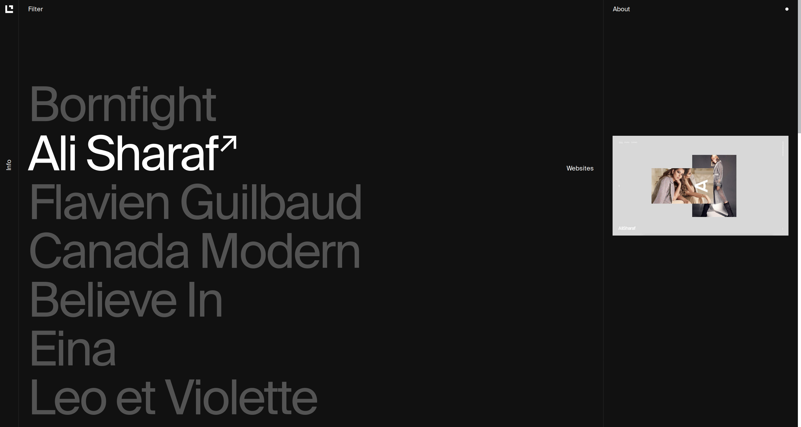

</h2>
<h1 align="center">Listed</h1>

A Curated List of Design Inspiration

# Notes

## Using WebP in gatsby-image

WebP is currently only support in Chrome so only effect it. This test is with 24
items with all item's images loaded (requires scrolling down the whole list as
they are lazy loaded). The below numbers are gzipped.

- Before - 1.2MB
- After - 740KB

This shows a roughly 40% reduction in total size. This reduction size does also
not take into account that the js and html bundles are basically the same size
both before and after using conditional WebP.
